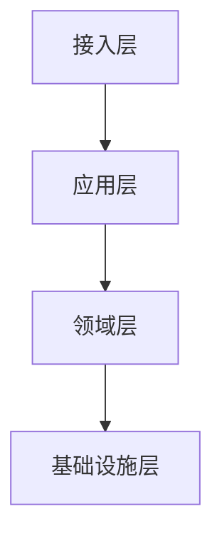

# 参考手册（compliant 样本）

## 架构总览

系统分层与调用链如下：



## 数据流

订单从接入层进入，经应用层编排后落入领域层。

## 各层调用量统计

```echarts
{
  "xAxis": {"type": "category", "data": ["接入层", "应用层", "领域层", "基础设施层"]},
  "yAxis": {"type": "value"},
  "series": [{"type": "bar", "data": [120, 200, 150, 80]}]
}
```
